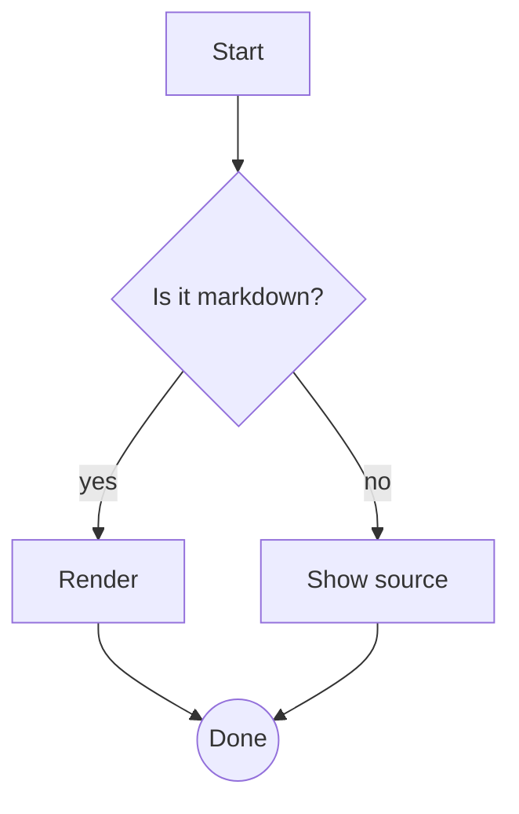
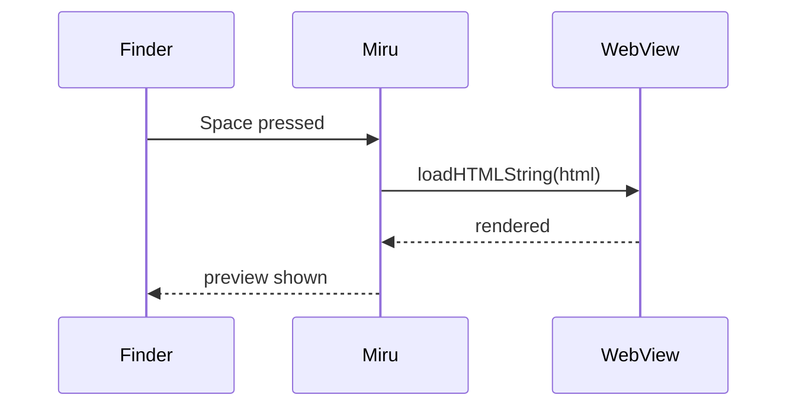

# Mermaid

## Flowchart

```mermaid
flowchart TD
    A[Start] --> B{Is it markdown?}
    B -- yes --> C[Render]
    B -- no --> D[Show source]
    C --> E((Done))
    D --> E
```

## Sequence diagram

```mermaid
sequenceDiagram
    participant Finder
    participant Miru
    participant WebView
    Finder->>Miru: Space pressed
    Miru->>WebView: loadHTMLString(html)
    WebView-->>Miru: rendered
    Miru-->>Finder: preview shown
```

## Malformed (must fail gracefully)

```mermaid
flowchart TD
    A[Start --> B{broken
    B ->> C[unclosed
```
