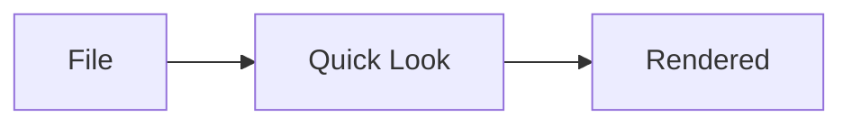
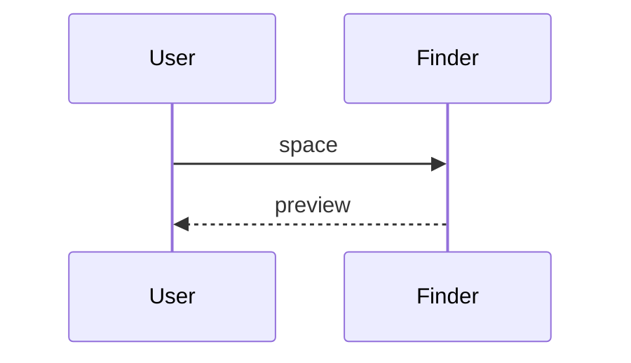

# Mixed Fixture

Everything in one document: basic markdown, every bundled highlight.js
language, and Mermaid diagrams — plus the intentionally malformed one.

## Text

**Bold**, *italic*, `inline code`, a [link](https://example.com), and
strikethrough via ~~GFM~~.

## Lists

- Alpha
- Beta
  1. nested one
  2. nested two
- Gamma

## Quote

> One quote to rule them all.

## Table

| Section | Purpose |
|---|---|
| Code | highlight.js coverage |
| Mermaid | diagram rendering |
| Text | basic markdown |

## Swift

```swift
let answer = 42
```

## Rust

```rust
fn main() -> Result<(), Box<dyn Error>> { Ok(()) }
```

## Bash

```bash
echo "hello"
```

## Python

```python
print("world")
```

## TypeScript

```typescript
const x: number = 1;
```

## JavaScript

```javascript
console.log(x);
```

## JSON

```json
{"ok": true}
```

## YAML

```yaml
key: value
```

## Go

```go
fmt.Println("go")
```

## Ruby

```ruby
puts "ruby"
```

## SQL

```sql
SELECT 1;
```

## XML

```xml
<root/>
```

## CSS

```css
a { color: red; }
```

## Markdown

```markdown
## nested markdown
```

## Untagged

```
no language here
```

## Mermaid flowchart



## Mermaid sequence



## Malformed mermaid


## Raw HTML (escaped)

<p>this raw html block must appear as literal text, not render as a paragraph</p>

---

Fin.
