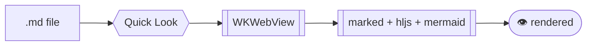
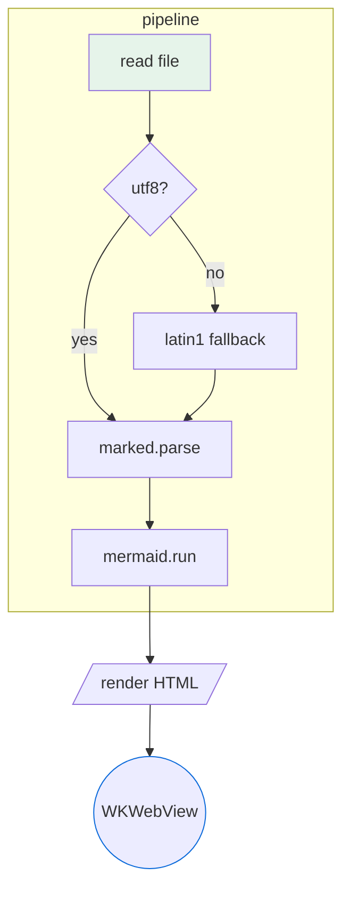
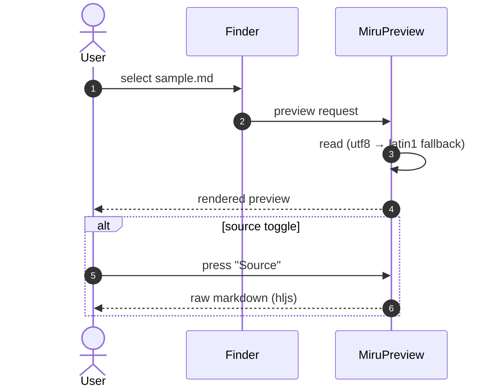
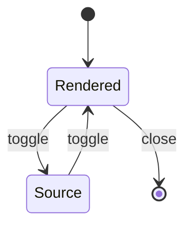
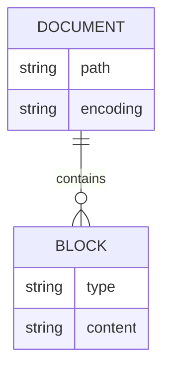
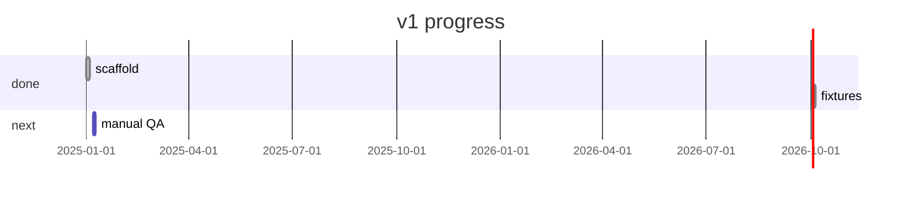
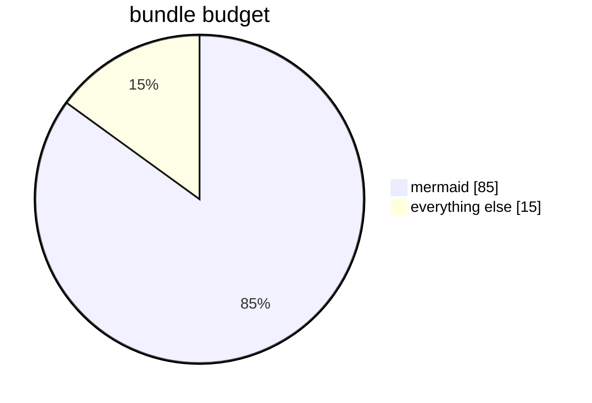

# Miru Sample — The Complete Markdown Tour

A stress-test document covering every Markdown component the preview renders.
Structure > styling > code > data > diagrams > internationalization.

> [!NOTE]
> This file doubles as a fixture: `just qltest sample.md`

---

## 1. Headings (h1–h6)

# H1 — an uncommon sight mid-document
## H2 — section marker
### H3 — subsection
#### H4 — rare
##### H5 — rarest
###### H6 — usually not what you want

Setext H1 alternative
=====================

Setext H2 alternative
---------------------

## 2. Emphasis

Regular, **bold**, __also bold__, *italic*, _also italic_, ***bold italic***,
~~strikethrough~~, `inline code`, **bold with *nested italic***, and
escapes: \*literal asterisks\*, \`literal backtick\`, \# not a heading,
\\[not a link\\] — plus entity forms: &copy; &amp; &lt; &#9829;

## 3. Links

- Inline: [Miru on GitHub](https://github.com/ruaylabs/miru "title text")
- Reference: [marked][1] and [highlight.js][hljs]
- Autolinked URL: https://example.com/path?q=1
- Email autolink: <hello@example.com>
- Angle-bracket autolink: <https://example.com>
- Fragment: [jump to diagrams](#9-diagrams)

[1]: https://github.com/markedjs/marked
[hljs]: https://highlightjs.org/ "syntax highlighting"

## 4. Blockquotes

> Simple quote.

> Nested layers:
>
> > A quote within a quote.
> >
> > With a list inside:
> > - one
> > - two

> ## Headings work in quotes too
>
> ```
> and fenced code
> ```

## 5. Lists

Unordered:

- apples
- oranges
  - blood oranges
    - deeply nested
- pears

Ordered:

1. First
2. Second
   1. Nested ordered
      1. Even deeper
3. Third — started from 1, continues from 3:
   1. continues numbering when the list is loose

Task list (GFM):

- [x] rendered markdown
- [x] mermaid diagrams
- [ ] printing (v1 non-goal)
- [ ] thumbnails (v1 non-goal)

Loose list with paragraphs:

- Item with a paragraph.

  Second paragraph of the same item.

- Next item.

## 6. Tables

| Component | Status | Notes |
|---|:---:|---:|
| headings | ✅ | h1–h6 + setext |
| emphasis | ✅ | GFM |
| raw HTML | 🔒 | escaped, never executed |
| scripts | ❌ | inert by design |
| very long cell content that should wrap or stretch the table | ok | overflow safe |

## 7. Horizontal rules

---

***

## 8. Code

Indented code block:

    # four-space indented block
    keeps its newlines
    but gets highlightAuto, no language tag

Fenced, tagged (subset — see `code.md` for the full bundle):

```swift
@main
struct Tour {
    let greeting = "hello"
    func run() -> String { greeting + ", 世界" }
}
```

```python
class Tour:
    stops: list[str] = ["markdown", "mermaid"]
    def __len__(self) -> int:
        return len(self.stops)
```

```rust
fn main() -> Result<(), std::io::Error> {
    println!("{} fixtures, {} diagrams", 9, 3);
    Ok(())
}
```

```bash
just qltest sample.md
```

```json
{"renderer": "marked", "highlighter": "highlight.js", "diagrams": "mermaid"}
```



Fence with the language *and* attributes, and a language that is not in the
bundle (must fall back to `highlightAuto`):

```haskell unknown-future-lang
main :: IO ()
main = putStrLn "auto-detected, not highlighted as haskell"
```

## 9. Diagrams

Flowchart with subgraphs and styling:



Sequence:



State diagram:



Entity relationship:



Gantt:



Pie:



## 10. Raw HTML (escaped to literal text)

<p>This paragraph tag must appear as text, not render.</p>
<b>bold via html</b> must not bold anything.

Inline: <kbd>Space</kbd>, <br> and  — all inert.

## 11. International & exotic text

CJK: 見る鏡、镜中见。한국어 샘플. 日本語のテスト。
RTL line: هذه فقرة عربية للتحقق من الاتجاه. עברית בדיקה.
Emoji: 🚀 🔥 ✅ ❌ 👀 🧪 — 👨‍👩‍👧‍👦 🇯🇵
Accents: café naïve déjà vu —Straße, Ich þå kew.
Combining: élévé, naimainen​zero-width.
Math-ish text: E = mc², πr², x₁ + x₂, ∀ε>0.

## 12. Footnote-free zone

Markdown features *not* rendered by this preview (marked has no plugin for
them in v1, per the dependency budget): `footnotes[^1]`, `:smile:` shortcode
emoji, `$$math$$`, definition lists, abbreviations. They will render as
literal text.

[^1]: like this one — footnote references show up as plain text

## 13. Images

Remote images will not load in the Quick Look sandbox (by design) — the alt
text is what you should see:


Local relative URLs resolve to the extension bundle, not your disk — missing
images show as broken/alt text:


---

*End of tour.* If everything above looks right — headings, emphasis, task
boxes, aligned tables, highlighted code (with a real `mermaid` fence that
also renders as a diagram), inert HTML, and clean CJK/RTL — then `sample.md`
passes.
